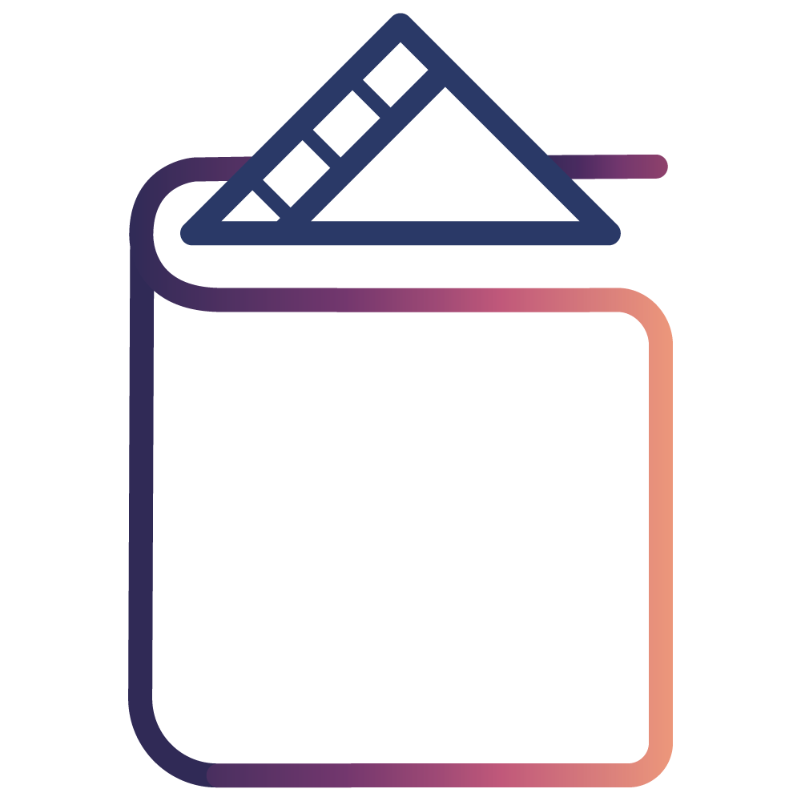

<!-- 로고 -->
 

  
   
  <h3 align="center">MODB</h3>

  

    <b>끝없이 펼쳐지는 영화 세상으로의 여정</b>
     
     
    <a href="https://github.com/jangjh0201/MODB"><strong>Explore the docs »</strong></a>
     
     
    <a href="https://github.com/jangjh0201/MODB">View Demo</a>
    ·
    <a href="https://github.com/jangjh0201/MODB/issues/new?labels=bug&template=bug-report---.md">Report Bug</a>
    ·
    <a href="https://github.com/jangjh0201/MODB/issues/new?labels=enhancement&template=feature-request---.md">Request Feature</a>
  

<!-- 목차 -->

  
목차

  <ol>
    <li>
      <a href="#프로젝트-소개">프로젝트 소개</a>
      <ul>
        <li><a href="#사용-기술">사용 기술</a></li>
      </ul>
    </li>
    <li>
      <a href="#시작하기">시작하기</a>
      <ul>
        <li><a href="#필수-조건">필수 조건</a></li>
        <li><a href="#설치">설치</a></li>
      </ul>
    </li>
    <li><a href="#사용">사용</a></li>
    <li><a href="#로드맵">로드맵</a></li>
    <li><a href="#기여하기">기여하기</a></li>
    <li><a href="#라이센스">라이센스</a></li>
    <li><a href="#문의">문의</a></li>
    <li><a href="#감사의-글">감사의 글</a></li>
  </ol>

<!-- 프로젝트 소개 -->
<h2 id="프로젝트-소개">프로젝트 소개</h2>

 
 

  이 프로젝트는 영화 검색 및 스크랩 기능을 제공하는 <strong>MODB</strong>입니다. 텍스트 에디터에서 아래 항목들을 검색 후 본인 프로젝트에 맞는 내용으로 대체해 사용하세요:

<ul>
  <li><code>github_username</code>: your_username</li>
  <li><code>linkedin_username</code>: your_username</li>
  <li><code>email</code>: your_email@example.com</li>
  <li><code>repo_name</code>: MODB</li>
  <li><code>project_title</code>: MODB</li>
  <li><code>project_description</code>: 이 프로젝트는 KMDB API를 통해 영화를 검색하고 스크랩할 수 있는 기능을 제공합니다.</li>
</ul>

(<a href="#맨-위로">맨 위로</a>)

<!-- 사용 기술 -->
<h3 id="사용-기술">사용 기술</h3>

<ul>
  <li></li>
  <li></li>
  <li></li>
  <li></li>
  <li></li>
  <li></li>
  <li></li>
  <li></li>
  <li></li>
  <li></li>
  <li></li>
</ul>

(<a href="#맨-위로">맨 위로</a>)

<!-- 시작하기 -->
<h2 id="시작하기">시작하기</h2>

이 섹션은 프로젝트를 로컬 환경에서 설정하는 방법에 대한 예시입니다. 로컬에서 프로젝트를 복사하고 실행하려면 다음 간단한 예시 단계를 따르세요.

<!-- 필수 조건 -->
<h3 id="필수-조건">필수 조건</h3>

이 섹션은 소프트웨어를 사용하기 위해 필요한 것들과 설치 방법을 나열하는 예시입니다.

<ol>
  <li><strong>Java JDK 17 이상</strong>
    <ul>
      <li><a href="https://www.oracle.com/java/technologies/javase/jdk17-archive-downloads.html">JDK 설치 가이드</a></li>
    </ul>
  </li>
  <li><strong>Gradle</strong>
    <ul>
      <li>프로젝트의 빌드 도구로 사용됩니다. <a href="https://gradle.org/install/">Gradle 설치 가이드</a></li>
    </ul>
  </li>
  <li><strong>Spring Boot</strong>
    <ul>
      <li>프로젝트의 프레임워크입니다. Spring Boot CLI를 사용하려면 <a href="https://docs.spring.io/spring-boot/docs/current/reference/html/getting-started.html#getting-started-installing-cli">설치 가이드</a>를 참고하세요.</li>
    </ul>
  </li>
  <li><strong>KMDB 영화 API 키</strong>
    <ul>
      <li>KMDB 영화 API를 사용하려면 API 키가 필요합니다. <a href="https://www.kmdb.or.kr/info/api/apiDetail/6">KMDB API 키 발급 가이드</a>에서 가입 후 API 키를 발급받으세요.</li>
      <li>발급받은 API 키는 프로젝트의 <code>application-API-KEY.yml</code> 파일에 아래와 같이 추가해야 합니다:</li>
    </ul>
    <pre><code>movie-api:
  key: {발급받은 API 키}
</code></pre>
  </li>
</ol>

<!-- 설치 -->
<h3 id="설치">설치</h3>

<em>아래는 애플리케이션을 설치하고 설정하는 방법을 설명하는 예시입니다.</em>

<ol>
  <li>레포지토리를 클론하세요.
    <pre><code>git clone https://github.com/jangjh0201/MODB.git
</code></pre>
  </li>
  <li>Gradle 의존성 패키지를 설치하세요.
    <pre><code>./gradlew build
</code></pre>
  </li>
  <li><code>application-API-KEY.yml</code> 파일을 프로젝트 resources 폴더에 생성하고, 발급받은 KMDB API 키를 아래 형식으로 입력하세요.
    <pre><code>movie-api:
  key: {발급받은 API 키}
</code></pre>
  </li>
  <li>애플리케이션을 실행하세요.
    <pre><code>./gradlew bootRun
</code></pre>
  </li>
</ol>

(<a href="#맨-위로">맨 위로</a>)

<!-- 사용 -->
<h2 id="사용">사용</h2>

이 프로젝트는 사용자가 원하는 영화를 검색하고, 스크랩하여 나만의 영화 목록을 관리할 수 있는 기능을 제공합니다. 아래는 프로젝트의 주요 기능과 사용 예시입니다.

<h3>1. 영화 검색 기능</h3>

KMDB API를 통해 영화 제목을 검색할 수 있습니다. 사용자가 검색창에 영화 제목을 입력하면, 실시간으로 검색 결과가 표시됩니다.

<!-- 검색 기능 스크린샷 -->

  

영화 제목을 입력한 후, 검색 결과는 아래와 같이 출력됩니다.

<h3>2. 영화 스크랩 기능</h3>

검색된 영화 중 마음에 드는 영화를 '스크랩'할 수 있습니다. 스크랩된 영화는 사용자 개인의 영화 목록에 저장됩니다. 이 기능은 사용자가 나중에 쉽게 꺼내볼 수 있도록 도와줍니다.

<!-- 영화 스크랩 GIF -->

  

저장 버튼을 클릭하면 선택한 영화가 개인 목록에 추가됩니다.

<h3>3. 개인 영화 목록 관리</h3>

사용자는 스크랩한 영화 목록을 언제든지 확인하고, 삭제할 수 있습니다. 이 목록은 사용자의 취향에 맞게 영화를 관리할 수 있도록 도와줍니다.

<!-- 개인 영화 목록 스크린샷 -->

  

<h3>4. 데모 및 예시 페이지</h3>

프로젝트를 직접 체험하고 싶다면, 아래의 데모 페이지를 방문해 주세요.

<!-- 웹서버 배포 후 링크 첨부 -->

<a href="https://yourproject-demo.com" target="_blank">프로젝트 데모 보기</a>

<em>더 많은 예시를 보려면, <a href="https://example.com">문서</a>를 참조하세요.</em>

(<a href="#맨-위로">맨 위로</a>)

<!-- 로드맵 -->
<h2 id="로드맵">로드맵</h2>

- [x] 영화 검색 기능 추가
- [x] 영화 저장/삭제 기능 추가
- [x] 모달창 저장/삭제 기능 추가
- [x] 로그인 기능 추가
- [ ] 회원가입 기능 추가
- [ ] 디자인 수정
- [ ] 다국어 지원
  - [ ] 영어

제안된 기능 목록(및 알려진 문제점)은 <a href="https://github.com/jangjh0201/MODB/issues" target="_blank">open issues</a>에서 확인할 수 있습니다.

(<a href="#맨-위로">맨 위로</a>)

<!-- 기여하기 -->
<h2 id="기여하기">기여하기</h2>

기여는 오픈 소스 커뮤니티를 배우고, 영감을 얻고, 창조하는 놀라운 공간으로 만드는 원동력입니다. 여러분이 해주시는 모든 기여에 <b>대단히 감사드립니다</b>.

더 나은 프로젝트를 위한 제안이 있다면, 레포지토리를 포크하고 풀 리퀘스트를 만들어 주세요. 또는 "enhancement" 태그를 달고 이슈를 생성하셔도 됩니다. 프로젝트에 별을 주는 것도 잊지 마세요! 다시 한 번 감사합니다!

<ol>
  <li>프로젝트 포크하기</li>
  <li>기능 브랜치 생성하기 (<code>git checkout -b feature/AmazingFeature</code>)</li>
  <li>변경 사항 커밋하기 (<code>git commit -m 'Add some AmazingFeature'</code>)</li>
  <li>브랜치에 푸시하기 (<code>git push origin feature/AmazingFeature</code>)</li>
  <li>풀 리퀘스트 열기</li>
</ol>

<h3>주요 기여자들:</h3>

(<a href="#맨-위로">맨 위로</a>)

<!-- 문의 -->
<h2 id="문의">문의</h2>

Junho Jang - <!-- <a href="https://www.linkedin.com/in/junho-jang-0917162b0/" target="_blank">LinkedIn 프로필</a> - --><a href="mailto:jangjh0201@gmail.com">jangjh0201@gmail.com</a>

프로젝트 링크: <a href="https://github.com/jangjh0201/MODB" target="_blank">https://github.com/jangjh0201/MODB</a>

(<a href="#맨-위로">맨 위로</a>)

<!-- 감사의 글 -->
<h2 id="감사의-글">감사의 글</h2>

이 문서를 만드는 데 도움을 받은 리소스를 나열하고, 그들에게 감사의 뜻을 전합니다. 몇 가지를 소개하며 시작해 보겠습니다!

<ul>
  <li><a href="https://choosealicense.com" target="_blank">Choose an Open Source License</a></li>
  <li><a href="https://www.webpagefx.com/tools/emoji-cheat-sheet" target="_blank">GitHub Emoji Cheat Sheet</a></li>
  <li><a href="https://flexbox.malven.co/" target="_blank">Malven's Flexbox Cheatsheet</a></li>
  <li><a href="https://grid.malven.co/" target="_blank">Malven's Grid Cheatsheet</a></li>
  <li><a href="https://shields.io" target="_blank">Img Shields</a></li>
  <li><a href="https://pages.github.com" target="_blank">GitHub Pages</a></li>
  <li><a href="https://fontawesome.com" target="_blank">Font Awesome</a></li>
  <li><a href="https://react-icons.github.io/react-icons/search" target="_blank">React Icons</a></li>
</ul>

(<a href="#맨-위로">맨 위로</a>)

<!-- MARKDOWN LINKS & IMAGES -->
<!-- https://www.markdownguide.org/basic-syntax/#reference-style-links -->

[contributors-shield]: https://img.shields.io/github/contributors/othneildrew/Best-README-Template.svg?style=for-the-badge
[contributors-url]: https://github.com/othneildrew/Best-README-Template/graphs/contributors
[forks-shield]: https://img.shields.io/github/forks/othneildrew/Best-README-Template.svg?style=for-the-badge
[forks-url]: https://github.com/othneildrew/Best-README-Template/network/members
[stars-shield]: https://img.shields.io/github/stars/othneildrew/Best-README-Template.svg?style=for-the-badge
[stars-url]: https://github.com/othneildrew/Best-README-Template/stargazers
[issues-shield]: https://img.shields.io/github/issues/othneildrew/Best-README-Template.svg?style=for-the-badge
[issues-url]: https://github.com/othneildrew/Best-README-Template/issues
[license-shield]: https://img.shields.io/github/license/othneildrew/Best-README-Template.svg?style=for-the-badge
[license-url]: https://github.com/othneildrew/Best-README-Template/blob/master/LICENSE.txt
[linkedin-shield]: https://img.shields.io/badge/-LinkedIn-black.svg?style=for-the-badge&logo=linkedin&colorB=555
[linkedin-url]: https://linkedin.com/in/othneildrew
[product-screenshot]: images/screenshot.png
[Next.js]: https://img.shields.io/badge/next.js-000000?style=for-the-badge&logo=nextdotjs&logoColor=white
[Next-url]: https://nextjs.org/
[React.js]: https://img.shields.io/badge/React-20232A?style=for-the-badge&logo=react&logoColor=61DAFB
[React-url]: https://reactjs.org/
[Vue.js]: https://img.shields.io/badge/Vue.js-35495E?style=for-the-badge&logo=vuedotjs&logoColor=4FC08D
[Vue-url]: https://vuejs.org/
[Angular.io]: https://img.shields.io/badge/Angular-DD0031?style=for-the-badge&logo=angular&logoColor=white
[Angular-url]: https://angular.io/
[Svelte.dev]: https://img.shields.io/badge/Svelte-4A4A55?style=for-the-badge&logo=svelte&logoColor=FF3E00
[Svelte-url]: https://svelte.dev/
[Laravel.com]: https://img.shields.io/badge/Laravel-FF2D20?style=for-the-badge&logo=laravel&logoColor=white
[Laravel-url]: https://laravel.com
[Bootstrap.com]: https://img.shields.io/badge/Bootstrap-563D7C?style=for-the-badge&logo=bootstrap&logoColor=white
[Bootstrap-url]: https://getbootstrap.com
[JQuery.com]: https://img.shields.io/badge/jQuery-0769AD?style=for-the-badge&logo=jquery&logoColor=white
[JQuery-url]: https://jquery.com
